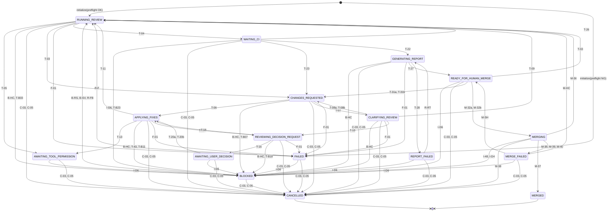

<!-- SPDX-License-Identifier: Apache-2.0 -->

# C-01 state machine（生成文書）

| Field | Value |
| --- | --- |
| Status | **生成file** — 手動で編集しない。正本はC-01実装のcode registry（`src/claude_code_codex_review_loop/domain/machine.py`のREGISTRY）とproperty / sequence test |
| 再生成 | `python tools/render_c01_docs.py`（snapshot照合testが一致を強制する） |
| 契約の正本 | [Phase 1計画](../plans/phase-01-domain-state-machine.md) / [implementation plan](../plans/implementation-plan.md)のC-01節 |

registryのrule数: **143**。guard列は有限discriminatorのみで構成され、一致ruleが常に0件または1件であることをproperty testが全数列挙で検証する（AC-C01-08）。
eventの受理には、VERIFIED系はpending（単一slot）とのkind / binding一致、解消系は対象blockとの完全一致が追加で要求される（表のpending / binding列）。

## 遷移図（可視stateの辺のみ。同一state内の遷移とcommandは遷移表を参照）

## 遷移表（registryから生成）

### canonical record（PRODUCED規約）

| Rule | From | Event | Guard | To | Commands |
| --- | --- | --- | --- | --- | --- |
| P-01 | RUNNING_REVIEW | RecordProduced | awaiting = CODEX_CODE_REVIEW、pending = ABSENT、record kind = REVIEW_RESULT | 同一state | PersistRecord |
| P-02 | APPLYING_FIXES | RecordProduced | awaiting = HOST_APPLY_FINDINGS、pending = ABSENT、record kind = FIX_RESULT | 同一state | PersistRecord |
| P-03 | CHANGES_REQUESTED | RecordProduced | awaiting = HOST_APPLY_FINDINGS、pending = ABSENT、record kind = CLARIFICATION_QUESTION | 同一state | PersistRecord |
| P-04 | CLARIFYING_REVIEW | RecordProduced | awaiting = CODEX_CLARIFICATION、pending = ABSENT、record kind = CLARIFICATION_ANSWER | 同一state | PersistRecord |
| P-05 | APPLYING_FIXES | RecordProduced | awaiting = HOST_APPLY_FINDINGS、pending = ABSENT、record kind = DECISION_REQUEST | 同一state | PersistRecord |
| P-06 | REVIEWING_DECISION_REQUEST | RecordProduced | awaiting = HOST_DRAFT_DECISION_REQUEST / HOST_REVISE_DECISION_REQUEST、pending = ABSENT、record kind = DECISION_REQUEST | 同一state | PersistRecord |
| P-07 | REVIEWING_DECISION_REQUEST | RecordProduced | awaiting = CODEX_DECISION_VERDICT、pending = ABSENT、record kind = DECISION_VERDICT | 同一state | PersistRecord |
| P-08 | REVIEWING_DECISION_REQUEST | RecordProduced | awaiting = HOST_DRAFT_DECISION_BRIEF、pending = ABSENT、record kind = DECISION_BRIEF | 同一state | PersistRecord |
| P-09 | REVIEWING_DECISION_REQUEST | RecordProduced | awaiting = HOST_RECORD_DECISION、pending = ABSENT、record kind = DECISION_RECORD | 同一state | PersistRecord |
| P-10 | APPLYING_FIXES | RecordProduced | awaiting = HOST_APPLY_FINDINGS、pending = ABSENT、record kind = EXTERNAL_DEPENDENCY | 同一state | PersistRecord |
| P-11 | RUNNING_REVIEW | RecordProduced | awaiting = CODEX_CODE_REVIEW、pending = ABSENT、record kind = PERMISSION_BLOCK | 同一state | PersistRecord |
| P-12 | APPLYING_FIXES | RecordProduced | awaiting = HOST_APPLY_FINDINGS、pending = ABSENT、record kind = PERMISSION_BLOCK | 同一state | PersistRecord |
| P-13 | WAITING_CI | RecordProduced | awaiting = CI_RESULT、pending = ABSENT、record kind = CI_TIMEOUT | 同一state | PersistRecord |
| P-14 | WAITING_CI | RecordProduced | awaiting = CI_RESULT、pending = ABSENT、record kind = CI_CODE_FAILURE | 同一state | PersistRecord |
| P-15 | GENERATING_REPORT | RecordProduced | awaiting = REPORT、pending = ABSENT、record kind = FINAL_REPORT | 同一state | PersistRecord |
| P-16 | READY_FOR_HUMAN_MERGE | RecordProduced | awaiting = HOST_ANSWER_GATE_QUESTION、pending = ABSENT、record kind = GATE_ANSWER | 同一state | PersistRecord |
| P-17 | AWAITING_USER_DECISION | RecordProduced | awaiting = USER_INPUT_DECISION、pending = ABSENT、record kind = USER_DECISION | 同一state | PersistRecord |
| P-18 | READY_FOR_HUMAN_MERGE | RecordProduced | awaiting = USER_INPUT_GATE、pending = ABSENT、record kind = GATE_QUESTION | 同一state | PersistRecord |
| P-19 | READY_FOR_HUMAN_MERGE | RecordProduced | awaiting = USER_INPUT_GATE、pending = ABSENT、record kind = GATE_CHANGES | 同一state | PersistRecord |
| P-20 | READY_FOR_HUMAN_MERGE | RecordProduced | awaiting = USER_INPUT_GATE、pending = ABSENT、record kind = MERGE_APPROVAL | 同一state | PersistRecord |
| P-22 | BLOCKED | RecordProduced | pending = ABSENT、record kind = BLOCK_INTERVENTION、block = PROGRESS、block reason = NO_PROGRESS | 同一state | PersistRecord |
| P-23 | BLOCKED | RecordProduced | pending = ABSENT、record kind = BLOCK_INTERVENTION、block = EXTERNAL_DEPENDENCY | 同一state | PersistRecord |
| P-21 | terminal以外の全state | RecordProduced | pending = ABSENT、record kind = USER_CANCEL | 同一state | PersistRecord |

### main workflow

| Rule | From | Event | Guard | To | Commands |
| --- | --- | --- | --- | --- | --- |
| T-03 | RUNNING_REVIEW | ReviewBlockingVerified | pending = MATCH、progress = CONTINUE | CHANGES_REQUESTED | RequestHostAction |
| T-04 | RUNNING_REVIEW | ReviewApprovedVerified | pending = MATCH | WAITING_CI | CheckCi |
| T-05 | RUNNING_REVIEW | ToolPermissionBlocked | pending = MATCH | AWAITING_TOOL_PERMISSION | — |
| T-06 | CHANGES_REQUESTED | FixStarted | awaiting = HOST_APPLY_FINDINGS、pending = ABSENT | APPLYING_FIXES | — |
| T-07 | CHANGES_REQUESTED | ClarificationQuestionVerified | pending = MATCH、progress = CONTINUE | CLARIFYING_REVIEW | RequestCodexReview |
| T-08a | CLARIFYING_REVIEW | ClarificationConfirmedVerified | pending = MATCH | CHANGES_REQUESTED | RequestHostAction |
| T-08b | CLARIFYING_REVIEW | ClarificationRevisedVerified | pending = MATCH | CHANGES_REQUESTED | RequestHostAction |
| T-09 | CLARIFYING_REVIEW | ClarificationWithdrawnVerified | pending = MATCH | RUNNING_REVIEW | RequestCodexReview |
| T-11 | APPLYING_FIXES | FixResultVerified | pending = MATCH、progress = CONTINUE | RUNNING_REVIEW | RequestCodexReview |
| T-13 | APPLYING_FIXES | ToolPermissionBlocked | pending = MATCH | AWAITING_TOOL_PERMISSION | — |
| T-21 | AWAITING_TOOL_PERMISSION | PermissionResumeValidated | awaiting = USER_INPUT_PERMISSION、pending = ABSENT | return_to | return_to対応の駆動command |
| T-43 | APPLYING_FIXES | ExternalDependencyVerified | pending = MATCH | BLOCKED | — |

### bounded progress（block進入）

| Rule | From | Event | Guard | To | Commands |
| --- | --- | --- | --- | --- | --- |
| T-B03 | RUNNING_REVIEW | ReviewBlockingVerified | pending = MATCH、progress = LIMIT_REACHED / NO_PROGRESS | BLOCKED | — |
| T-B07 | CHANGES_REQUESTED | ClarificationQuestionVerified | pending = MATCH、progress = LIMIT_REACHED / NO_PROGRESS | BLOCKED | — |
| T-B11 | APPLYING_FIXES | FixResultVerified | pending = MATCH、progress = LIMIT_REACHED / NO_PROGRESS | BLOCKED | — |
| T-B19 | REVIEWING_DECISION_REQUEST | VerdictResubmitVerified | pending = MATCH、progress = LIMIT_REACHED / NO_PROGRESS | BLOCKED | — |
| T-B23 | WAITING_CI | CiCodeFailureVerified | pending = MATCH、progress = LIMIT_REACHED / NO_PROGRESS | BLOCKED | — |

### decision flow

| Rule | From | Event | Guard | To | Commands |
| --- | --- | --- | --- | --- | --- |
| T-10 | CLARIFYING_REVIEW | ClarificationEscalatedVerified | pending = MATCH | REVIEWING_DECISION_REQUEST | RequestHostAction |
| T-12 | APPLYING_FIXES | DecisionRequestVerified | pending = MATCH | REVIEWING_DECISION_REQUEST | RequestCodexReview |
| T-14 | REVIEWING_DECISION_REQUEST | DecisionRequestVerified | pending = MATCH | 同一state | RequestCodexReview |
| T-15 | REVIEWING_DECISION_REQUEST | VerdictAskUserVerified | pending = MATCH | 同一state | RequestHostAction |
| T-16 | REVIEWING_DECISION_REQUEST | DecisionBriefVerified | pending = MATCH | AWAITING_USER_DECISION | — |
| T-17 | REVIEWING_DECISION_REQUEST | VerdictProceedVerified | pending = MATCH | 同一state | RequestHostAction |
| T-18 | REVIEWING_DECISION_REQUEST | DecisionRecordVerified | pending = MATCH | APPLYING_FIXES | RequestHostAction |
| T-19 | REVIEWING_DECISION_REQUEST | VerdictResubmitVerified | pending = MATCH、progress = CONTINUE | 同一state | RequestHostAction |
| T-20a | AWAITING_USER_DECISION | UserDecisionVerified | pending = MATCH | APPLYING_FIXES | RequestHostAction |
| T-20b | AWAITING_USER_DECISION | UserDecisionVerified | awaiting = USER_INPUT_DECISION、pending = ABSENT | APPLYING_FIXES | RequestHostAction |

### CI

| Rule | From | Event | Guard | To | Commands |
| --- | --- | --- | --- | --- | --- |
| T-22 | WAITING_CI | CiSucceeded | awaiting = CI_RESULT、pending = ABSENT | GENERATING_REPORT | GenerateReport |
| T-23 | WAITING_CI | CiCodeFailureVerified | pending = MATCH、progress = CONTINUE | CHANGES_REQUESTED | InvalidateApprovals、RequestHostAction |
| T-24 | WAITING_CI | CiInfraFailure | awaiting = CI_RESULT、pending = ABSENT | 同一state | CheckCi |
| T-25 | WAITING_CI | CiTimeoutRecorded | pending = MATCH | 同一state | — |
| T-26 | WAITING_CI | HeadChangedExternally | pending = ABSENT | RUNNING_REVIEW | InvalidateApprovals、RequestCodexReview |

### final report

| Rule | From | Event | Guard | To | Commands |
| --- | --- | --- | --- | --- | --- |
| T-27 | GENERATING_REPORT | ReportVerified | pending = MATCH | READY_FOR_HUMAN_MERGE | — |
| T-28 | GENERATING_REPORT | ReportFailed | awaiting = REPORT、pending = ABSENT | REPORT_FAILED | — |

### merge gate

| Rule | From | Event | Guard | To | Commands |
| --- | --- | --- | --- | --- | --- |
| T-29a | READY_FOR_HUMAN_MERGE | GateQuestionVerified | pending = MATCH | 同一state | RequestHostAction |
| T-29b | READY_FOR_HUMAN_MERGE | GateQuestionVerified | awaiting = USER_INPUT_GATE、pending = ABSENT | 同一state | RequestHostAction |
| T-30 | READY_FOR_HUMAN_MERGE | GateAnswerVerified | pending = MATCH | 同一state | — |
| T-31a | READY_FOR_HUMAN_MERGE | GateChangesVerified | pending = MATCH | CHANGES_REQUESTED | InvalidateApprovals、RequestHostAction |
| T-31b | READY_FOR_HUMAN_MERGE | GateChangesVerified | awaiting = USER_INPUT_GATE、pending = ABSENT | CHANGES_REQUESTED | InvalidateApprovals、RequestHostAction |
| T-33 | READY_FOR_HUMAN_MERGE | HeadChangedExternally | pending = ABSENT | RUNNING_REVIEW | InvalidateApprovals、RequestCodexReview |

### merge transaction

| Rule | From | Event | Guard | To | Commands |
| --- | --- | --- | --- | --- | --- |
| M-32a | READY_FOR_HUMAN_MERGE | MergeApprovalVerified | pending = MATCH | MERGING | VerifyMergePreconditions |
| M-32b | READY_FOR_HUMAN_MERGE | MergeApprovalVerified | awaiting = USER_INPUT_GATE、pending = ABSENT | MERGING | VerifyMergePreconditions |
| M-34 | MERGING | MergePreconditionsOk | awaiting = MERGE_PRECONDITIONS、pending = ABSENT | MERGING | ExecuteMerge |
| M-35 | MERGING | MergePreconditionMismatch | awaiting = MERGE_PRECONDITIONS、pending = ABSENT | MERGE_FAILED | — |
| M-36 | MERGING | HeadChangedExternally | awaiting = MERGE_PRECONDITIONS、pending = ABSENT | RUNNING_REVIEW | InvalidateApprovals、RequestCodexReview |
| M-37 | MERGING | MergeConfirmed | awaiting = MERGE_OUTCOME_CANCEL / MERGE_OUTCOME_EXECUTE / MERGE_OUTCOME_FAILURE、pending = ABSENT、deferredなし | MERGED | — |
| M-38 | MERGING | MergeNotExecutedConfirmed | awaiting = MERGE_OUTCOME_CANCEL、pending = ABSENT、deferredなし | CANCELLED | — |
| M-39 | MERGING | MergeNotExecutedConfirmed | awaiting = MERGE_OUTCOME_FAILURE、pending = ABSENT、deferredなし | MERGE_FAILED | — |
| M-40 | MERGING | MergeOutcomeUnknown | awaiting = MERGE_OUTCOME_CANCEL / MERGE_OUTCOME_EXECUTE / MERGE_OUTCOME_FAILURE、pending = ABSENT、deferredなし | MERGE_FAILED | — |
| M-41a | MERGING | UserCancelVerified | pending = MATCH | MERGING | QueryMergeOutcome |
| M-41b | MERGING | UserCancelVerified | pending = ABSENT | MERGING | QueryMergeOutcome |
| M-42 | MERGING | RunFailed | awaiting = MERGE_OUTCOME_CANCEL / MERGE_OUTCOME_EXECUTE / MERGE_OUTCOME_FAILURE / MERGE_PRECONDITIONS | MERGING | QueryMergeOutcome |
| M-SH | MERGE_FAILED | ResumeSameHeadValidated | pending = ABSENT | READY_FOR_HUMAN_MERGE | — |
| M-HC | MERGE_FAILED | HeadChangedExternally | pending = ABSENT | RUNNING_REVIEW | InvalidateApprovals、RequestCodexReview |

### cancellation

| Rule | From | Event | Guard | To | Commands |
| --- | --- | --- | --- | --- | --- |
| C-01 | APPLYING_FIXES / AWAITING_TOOL_PERMISSION / AWAITING_USER_DECISION / BLOCKED / CHANGES_REQUESTED / CLARIFYING_REVIEW / FAILED / GENERATING_REPORT / MERGE_FAILED / READY_FOR_HUMAN_MERGE / REPORT_FAILED / REVIEWING_DECISION_REQUEST / RUNNING_REVIEW / WAITING_CI | UserCancelVerified | pending = MATCH | 同一state（cancelling） | HaltRun |
| C-02 | APPLYING_FIXES / AWAITING_TOOL_PERMISSION / AWAITING_USER_DECISION / BLOCKED / CHANGES_REQUESTED / CLARIFYING_REVIEW / FAILED / GENERATING_REPORT / MERGE_FAILED / READY_FOR_HUMAN_MERGE / REPORT_FAILED / REVIEWING_DECISION_REQUEST / RUNNING_REVIEW / WAITING_CI | UserCancelVerified | pending = ABSENT / MISMATCH | 同一state（cancelling） | HaltRun |
| C-03 | APPLYING_FIXES / AWAITING_TOOL_PERMISSION / AWAITING_USER_DECISION / BLOCKED / CHANGES_REQUESTED / CLARIFYING_REVIEW / FAILED / GENERATING_REPORT / MERGE_FAILED / READY_FOR_HUMAN_MERGE / REPORT_FAILED / REVIEWING_DECISION_REQUEST / RUNNING_REVIEW / WAITING_CI | CancellationCompleted | procedure = CANCELLING、binding = MATCH、deferredなし | CANCELLED | — |
| C-04 | APPLYING_FIXES / AWAITING_TOOL_PERMISSION / AWAITING_USER_DECISION / BLOCKED / CHANGES_REQUESTED / CLARIFYING_REVIEW / FAILED / GENERATING_REPORT / MERGE_FAILED / READY_FOR_HUMAN_MERGE / REPORT_FAILED / REVIEWING_DECISION_REQUEST / RUNNING_REVIEW / WAITING_CI | CancellationCompleted | procedure = CANCELLING、binding = MATCH、deferredあり | 同一state（incident記録） | RecordIntegrityIncident |
| C-05 | APPLYING_FIXES / AWAITING_TOOL_PERMISSION / AWAITING_USER_DECISION / BLOCKED / CHANGES_REQUESTED / CLARIFYING_REVIEW / FAILED / GENERATING_REPORT / MERGE_FAILED / READY_FOR_HUMAN_MERGE / REPORT_FAILED / REVIEWING_DECISION_REQUEST / RUNNING_REVIEW / WAITING_CI | CancellationCompleted | binding = MATCH、deferredなし | CANCELLED | — |

### 失敗（EV_RUN_FAILED）

| Rule | From | Event | Guard | To | Commands |
| --- | --- | --- | --- | --- | --- |
| F-01 | APPLYING_FIXES / CHANGES_REQUESTED / CLARIFYING_REVIEW / GENERATING_REPORT / REVIEWING_DECISION_REQUEST / RUNNING_REVIEW | RunFailed | — | FAILED | — |
| F-02 | AWAITING_TOOL_PERMISSION / AWAITING_USER_DECISION / BLOCKED / FAILED / MERGE_FAILED / READY_FOR_HUMAN_MERGE / REPORT_FAILED / WAITING_CI | RunFailed | — | 同一state | — |

### 横断規則（手続き中の冪等再発行）

| Rule | From | Event | Guard | To | Commands |
| --- | --- | --- | --- | --- | --- |
| X-C0 | APPLYING_FIXES / AWAITING_TOOL_PERMISSION / AWAITING_USER_DECISION / BLOCKED / CHANGES_REQUESTED / CLARIFYING_REVIEW / FAILED / GENERATING_REPORT / MERGE_FAILED / READY_FOR_HUMAN_MERGE / REPORT_FAILED / REVIEWING_DECISION_REQUEST / RUNNING_REVIEW / WAITING_CI | RunFailed | procedure = CANCELLING | 同一state | HaltRun |
| X-H0 | APPLYING_FIXES / CHANGES_REQUESTED / CLARIFYING_REVIEW / GENERATING_REPORT / REVIEWING_DECISION_REQUEST / RUNNING_REVIEW | RunFailed | procedure = HALTING_FOR_BLOCK | 同一state | HaltRun |
| X-I0a | terminal以外の全state | RunFailed | procedure = RECORDING_INCIDENT、pending = ABSENT | 同一state | RecordIntegrityIncident |
| X-I0b | terminal以外の全state | RunFailed | procedure = RECORDING_INCIDENT、pending = PRESENT | 同一state | PersistRecord |
| X-C1 | APPLYING_FIXES / AWAITING_TOOL_PERMISSION / AWAITING_USER_DECISION / BLOCKED / CHANGES_REQUESTED / CLARIFYING_REVIEW / FAILED / GENERATING_REPORT / MERGE_FAILED / READY_FOR_HUMAN_MERGE / REPORT_FAILED / REVIEWING_DECISION_REQUEST / RUNNING_REVIEW / WAITING_CI | ResumeValidated | procedure = CANCELLING | 同一state | HaltRun |
| X-H1 | APPLYING_FIXES / CHANGES_REQUESTED / CLARIFYING_REVIEW / GENERATING_REPORT / REVIEWING_DECISION_REQUEST / RUNNING_REVIEW | ResumeValidated | procedure = HALTING_FOR_BLOCK | 同一state | HaltRun |
| X-I1a | terminal以外の全state | ResumeValidated | procedure = RECORDING_INCIDENT、pending = ABSENT | 同一state | RecordIntegrityIncident |
| X-I1b | terminal以外の全state | ResumeValidated | procedure = RECORDING_INCIDENT、pending = PRESENT | 同一state | PersistRecord |
| X-C2 | APPLYING_FIXES / AWAITING_TOOL_PERMISSION / AWAITING_USER_DECISION / BLOCKED / CHANGES_REQUESTED / CLARIFYING_REVIEW / FAILED / GENERATING_REPORT / MERGE_FAILED / READY_FOR_HUMAN_MERGE / REPORT_FAILED / REVIEWING_DECISION_REQUEST / RUNNING_REVIEW / WAITING_CI | ResumeFallbackRequired | procedure = CANCELLING | 同一state | HaltRun |
| X-H2 | APPLYING_FIXES / CHANGES_REQUESTED / CLARIFYING_REVIEW / GENERATING_REPORT / REVIEWING_DECISION_REQUEST / RUNNING_REVIEW | ResumeFallbackRequired | procedure = HALTING_FOR_BLOCK | 同一state | HaltRun |
| X-I2a | terminal以外の全state | ResumeFallbackRequired | procedure = RECORDING_INCIDENT、pending = ABSENT | 同一state | RecordIntegrityIncident |
| X-I2b | terminal以外の全state | ResumeFallbackRequired | procedure = RECORDING_INCIDENT、pending = PRESENT | 同一state | PersistRecord |
| X-C3 | APPLYING_FIXES / AWAITING_TOOL_PERMISSION / AWAITING_USER_DECISION / BLOCKED / CHANGES_REQUESTED / CLARIFYING_REVIEW / FAILED / GENERATING_REPORT / MERGE_FAILED / READY_FOR_HUMAN_MERGE / REPORT_FAILED / REVIEWING_DECISION_REQUEST / RUNNING_REVIEW / WAITING_CI | ResumeSameHeadValidated | procedure = CANCELLING | 同一state | HaltRun |
| X-H3 | APPLYING_FIXES / CHANGES_REQUESTED / CLARIFYING_REVIEW / GENERATING_REPORT / REVIEWING_DECISION_REQUEST / RUNNING_REVIEW | ResumeSameHeadValidated | procedure = HALTING_FOR_BLOCK | 同一state | HaltRun |
| X-I3a | terminal以外の全state | ResumeSameHeadValidated | procedure = RECORDING_INCIDENT、pending = ABSENT | 同一state | RecordIntegrityIncident |
| X-I3b | terminal以外の全state | ResumeSameHeadValidated | procedure = RECORDING_INCIDENT、pending = PRESENT | 同一state | PersistRecord |
| X-C4 | APPLYING_FIXES / AWAITING_TOOL_PERMISSION / AWAITING_USER_DECISION / BLOCKED / CHANGES_REQUESTED / CLARIFYING_REVIEW / FAILED / GENERATING_REPORT / MERGE_FAILED / READY_FOR_HUMAN_MERGE / REPORT_FAILED / REVIEWING_DECISION_REQUEST / RUNNING_REVIEW / WAITING_CI | CiResumeRequested | procedure = CANCELLING | 同一state | HaltRun |
| X-H4 | APPLYING_FIXES / CHANGES_REQUESTED / CLARIFYING_REVIEW / GENERATING_REPORT / REVIEWING_DECISION_REQUEST / RUNNING_REVIEW | CiResumeRequested | procedure = HALTING_FOR_BLOCK | 同一state | HaltRun |
| X-I4a | terminal以外の全state | CiResumeRequested | procedure = RECORDING_INCIDENT、pending = ABSENT | 同一state | RecordIntegrityIncident |
| X-I4b | terminal以外の全state | CiResumeRequested | procedure = RECORDING_INCIDENT、pending = PRESENT | 同一state | PersistRecord |
| X-C5 | APPLYING_FIXES / AWAITING_TOOL_PERMISSION / AWAITING_USER_DECISION / BLOCKED / CHANGES_REQUESTED / CLARIFYING_REVIEW / FAILED / GENERATING_REPORT / MERGE_FAILED / READY_FOR_HUMAN_MERGE / REPORT_FAILED / REVIEWING_DECISION_REQUEST / RUNNING_REVIEW / WAITING_CI | PermissionResumeValidated | procedure = CANCELLING | 同一state | HaltRun |
| X-H5 | APPLYING_FIXES / CHANGES_REQUESTED / CLARIFYING_REVIEW / GENERATING_REPORT / REVIEWING_DECISION_REQUEST / RUNNING_REVIEW | PermissionResumeValidated | procedure = HALTING_FOR_BLOCK | 同一state | HaltRun |
| X-I5a | terminal以外の全state | PermissionResumeValidated | procedure = RECORDING_INCIDENT、pending = ABSENT | 同一state | RecordIntegrityIncident |
| X-I5b | terminal以外の全state | PermissionResumeValidated | procedure = RECORDING_INCIDENT、pending = PRESENT | 同一state | PersistRecord |
| X-C6 | APPLYING_FIXES / AWAITING_TOOL_PERMISSION / AWAITING_USER_DECISION / BLOCKED / CHANGES_REQUESTED / CLARIFYING_REVIEW / FAILED / GENERATING_REPORT / MERGE_FAILED / READY_FOR_HUMAN_MERGE / REPORT_FAILED / REVIEWING_DECISION_REQUEST / RUNNING_REVIEW / WAITING_CI | ReporterRetryRequested | procedure = CANCELLING | 同一state | HaltRun |
| X-H6 | APPLYING_FIXES / CHANGES_REQUESTED / CLARIFYING_REVIEW / GENERATING_REPORT / REVIEWING_DECISION_REQUEST / RUNNING_REVIEW | ReporterRetryRequested | procedure = HALTING_FOR_BLOCK | 同一state | HaltRun |
| X-I6a | terminal以外の全state | ReporterRetryRequested | procedure = RECORDING_INCIDENT、pending = ABSENT | 同一state | RecordIntegrityIncident |
| X-I6b | terminal以外の全state | ReporterRetryRequested | procedure = RECORDING_INCIDENT、pending = PRESENT | 同一state | PersistRecord |

### resume

| Rule | From | Event | Guard | To | Commands |
| --- | --- | --- | --- | --- | --- |
| R-P | terminal以外の全state | ResumeValidated | pending = PRESENT | pendingのsource_state | PersistRecord |
| R-A1 | FAILED | ResumeValidated | awaiting = CI_RESULT / CODEX_CLARIFICATION / CODEX_CODE_REVIEW / CODEX_DECISION_VERDICT / HOST_ANSWER_GATE_QUESTION / HOST_APPLY_FINDINGS / HOST_DRAFT_DECISION_BRIEF / HOST_DRAFT_DECISION_REQUEST / HOST_RECORD_DECISION / HOST_REVISE_DECISION_REQUEST / MERGE_OUTCOME_CANCEL / MERGE_OUTCOME_EXECUTE / MERGE_OUTCOME_FAILURE / MERGE_PRECONDITIONS / REPORT / USER_INPUT_DECISION / USER_INPUT_GATE / USER_INPUT_PERMISSION、pending = ABSENT、recovery_toあり | recovery_to | awaiting対応command |
| R-A2 | APPLYING_FIXES / AWAITING_TOOL_PERMISSION / AWAITING_USER_DECISION / CHANGES_REQUESTED / CLARIFYING_REVIEW / GENERATING_REPORT / MERGE_FAILED / MERGING / READY_FOR_HUMAN_MERGE / REPORT_FAILED / REVIEWING_DECISION_REQUEST / RUNNING_REVIEW / WAITING_CI | ResumeValidated | awaiting = CI_RESULT / CODEX_CLARIFICATION / CODEX_CODE_REVIEW / CODEX_DECISION_VERDICT / HOST_ANSWER_GATE_QUESTION / HOST_APPLY_FINDINGS / HOST_DRAFT_DECISION_BRIEF / HOST_DRAFT_DECISION_REQUEST / HOST_RECORD_DECISION / HOST_REVISE_DECISION_REQUEST / MERGE_OUTCOME_CANCEL / MERGE_OUTCOME_EXECUTE / MERGE_OUTCOME_FAILURE / MERGE_PRECONDITIONS / REPORT / USER_INPUT_DECISION / USER_INPUT_GATE / USER_INPUT_PERMISSION、pending = ABSENT | 同一state | awaiting対応command |
| R-D | FAILED | ResumeValidated | awaiting = None、pending = ABSENT、recovery_toあり | recovery_to | recovery_to対応の駆動command |
| R-B | BLOCKED | ResumeValidated | pending = ABSENT | BLOCKED | — |
| R-F | FAILED | ResumeFallbackRequired | recovery_toあり | RUNNING_REVIEW | InvalidateApprovals、RequestCodexReview |
| R-FB | BLOCKED | ResumeFallbackRequired | block = EXTERNAL_DEPENDENCY / PROGRESS | RUNNING_REVIEW | InvalidateApprovals、RequestCodexReview |
| R-CI | WAITING_CI | CiResumeRequested | awaiting = CI_RESULT / None、pending = ABSENT | WAITING_CI | CheckCi |
| R-RT | REPORT_FAILED | ReporterRetryRequested | awaiting = None、pending = ABSENT | GENERATING_REPORT | GenerateReport |

### integrity violation

| Rule | From | Event | Guard | To | Commands |
| --- | --- | --- | --- | --- | --- |
| I-D1 | terminal以外の全state | RecordIntegrityViolationDetected | procedure = RECORDING_INCIDENT | 同一state | InvalidateApprovals |
| I-D2 | APPLYING_FIXES / AWAITING_TOOL_PERMISSION / AWAITING_USER_DECISION / BLOCKED / CHANGES_REQUESTED / CLARIFYING_REVIEW / FAILED / GENERATING_REPORT / MERGE_FAILED / READY_FOR_HUMAN_MERGE / REPORT_FAILED / REVIEWING_DECISION_REQUEST / RUNNING_REVIEW / WAITING_CI | RecordIntegrityViolationDetected | procedure = CANCELLING | 同一state | InvalidateApprovals |
| I-D3 | MERGING | RecordIntegrityViolationDetected | awaiting = MERGE_OUTCOME_CANCEL / MERGE_OUTCOME_EXECUTE / MERGE_OUTCOME_FAILURE | MERGING | InvalidateApprovals、QueryMergeOutcome |
| I-D4 | MERGING | RecordIntegrityViolationDetected | awaiting = MERGE_PRECONDITIONS | BLOCKED | InvalidateApprovals |
| I-D5 | APPLYING_FIXES / CHANGES_REQUESTED / CLARIFYING_REVIEW / GENERATING_REPORT / REVIEWING_DECISION_REQUEST / RUNNING_REVIEW | RecordIntegrityViolationDetected | — | 同一state（halt gate） | InvalidateApprovals、HaltRun |
| I-D5u | APPLYING_FIXES / CHANGES_REQUESTED / CLARIFYING_REVIEW / GENERATING_REPORT / REVIEWING_DECISION_REQUEST / RUNNING_REVIEW | RecordIntegrityViolationDetected | procedure = HALTING_FOR_BLOCK | 同一state（halt gate） | InvalidateApprovals |
| I-D6 | AWAITING_TOOL_PERMISSION / AWAITING_USER_DECISION / FAILED / MERGE_FAILED / READY_FOR_HUMAN_MERGE / REPORT_FAILED / WAITING_CI | RecordIntegrityViolationDetected | — | BLOCKED | InvalidateApprovals |
| I-D7 | BLOCKED | RecordIntegrityViolationDetected | block = RECORD_INTEGRITY | BLOCKED | InvalidateApprovals |
| I-D8 | BLOCKED | RecordIntegrityViolationDetected | block = EXTERNAL_DEPENDENCY / PROGRESS | BLOCKED | InvalidateApprovals |
| B-HC | APPLYING_FIXES / CHANGES_REQUESTED / CLARIFYING_REVIEW / GENERATING_REPORT / REVIEWING_DECISION_REQUEST / RUNNING_REVIEW | BlockHaltCompleted | procedure = HALTING_FOR_BLOCK、binding = MATCH | BLOCKED | — |

### incident監査

| Rule | From | Event | Guard | To | Commands |
| --- | --- | --- | --- | --- | --- |
| I-P | terminal以外の全state | RecordProduced | procedure = RECORDING_INCIDENT、pending = ABSENT、record kind = INTEGRITY_INCIDENT | 同一state | PersistRecord |
| I-VC | terminal以外の全state | IntegrityIncidentVerified | procedure = RECORDING_INCIDENT、pending = MATCH、coverage = COMPLETE | incident_target（MERGED / CANCELLED） | — |
| I-VR | terminal以外の全state | IntegrityIncidentVerified | procedure = RECORDING_INCIDENT、pending = MATCH、coverage = REMAINDER | 同一state（incident記録の継続） | RecordIntegrityIncident |
| I-46 | MERGING | MergeConfirmed | awaiting = MERGE_OUTCOME_CANCEL / MERGE_OUTCOME_EXECUTE / MERGE_OUTCOME_FAILURE、pending = ABSENT、deferredあり | MERGING（incident記録） | RecordIntegrityIncident |
| I-47 | MERGING | MergeNotExecutedConfirmed | awaiting = MERGE_OUTCOME_CANCEL、pending = ABSENT、deferredあり | MERGING（incident記録） | RecordIntegrityIncident |
| I-48 | MERGING | MergeNotExecutedConfirmed | awaiting = MERGE_OUTCOME_FAILURE、pending = ABSENT、deferredあり | BLOCKED | — |
| I-49 | MERGING | MergeOutcomeUnknown | awaiting = MERGE_OUTCOME_CANCEL / MERGE_OUTCOME_EXECUTE / MERGE_OUTCOME_FAILURE、pending = ABSENT、deferredあり | MERGING | QueryMergeOutcome |

### block解消

| Rule | From | Event | Guard | To | Commands |
| --- | --- | --- | --- | --- | --- |
| B-LR | BLOCKED | BlockResolvedLimitRaised | pending = ABSENT、binding = MATCH、block = PROGRESS、block reason = LIMIT_REACHED | continuationのresume_state | 保存したcommand列 |
| B-IV1 | BLOCKED | BlockResolvedIntervention | pending = ABSENT / MATCH、binding = MATCH、block = PROGRESS、block reason = NO_PROGRESS | continuationのresume_state | 保存したcommand列 |
| B-IV2 | BLOCKED | BlockResolvedIntervention | pending = ABSENT / MATCH、binding = MATCH、block = EXTERNAL_DEPENDENCY | continuationのresume_state | 保存したcommand列 |
| B-RS | BLOCKED | IntegrityRestoredValidated | pending = ABSENT、binding = MATCH、block = RECORD_INTEGRITY | RUNNING_REVIEW | InvalidateApprovals、RequestCodexReview |
| B-SV | BLOCKED | IntegritySalvageEstablished | pending = ABSENT、binding = MATCH、block = RECORD_INTEGRITY | RUNNING_REVIEW | InvalidateApprovals、RequestCodexReview |
