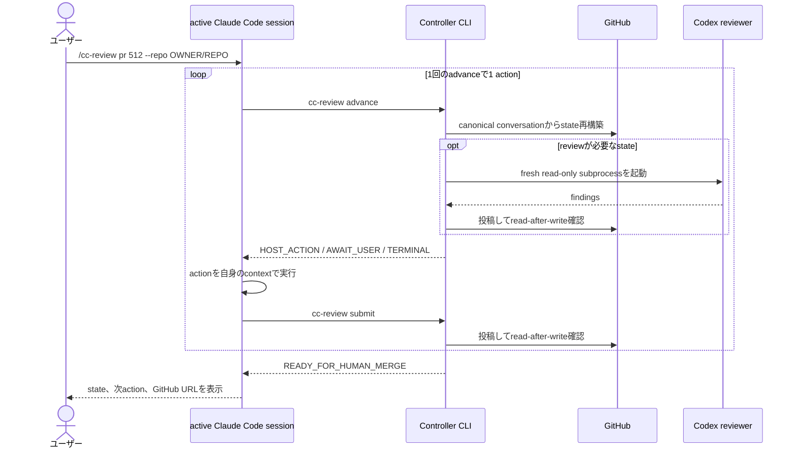

<!-- SPDX-License-Identifier: Apache-2.0 -->

# Architecture overview

| Field | Value |
| --- | --- |
| Authority | **Draft**。詳細の正本は[implementation plan](../plans/implementation-plan.md) |
| 対象読者 | 本projectへ初めて参加する開発者 |

最初に読む1ページです。用語は[glossary](../glossary.md)を参照してください。

## 何をするものか

GitHubのIssueまたはPRを指定して起動すると、Claude Codeが実装し、Codexがread-onlyでreviewし、両者の発言をGitHubへ記録しながら、人間が明示的にmergeを承認するまで進みます。

## 役割

| 役割 | 担当 | できないこと |
| --- | --- | --- |
| ユーザー | 実行開始、判断、mergeの明示承認 | — |
| Controller | 決定論的なstate machine。GitHub投稿、process起動、schema検証、merge実行 | LLMを内包しない。意味的な要約や推奨を作らない |
| Claude Code（active host） | 実装、test、commit、push、説明、ユーザー入力の構造化 | GitHubへ直接書き込まない。mergeしない |
| Codex（fresh reviewer） | 隔離checkout内でのreview、test、再現、read-only Web調査 | 実repositoryとGitHubを変更しない |

## 主経路: advance / submit

Controller CLIはClaude Code sessionの子processとして起動されるため、親のLLM turnを呼び戻せません。そのためcore engineはClaudeを起動せず、**次に何をすべきかを返す**step engineとして動きます。



Controllerが直接起動するのはCodex reviewerだけです。Claude coderは主経路では常にactive host側で動作し、会話contextを保ちます。

## Component map

15 componentの一覧と依存とPhaseは[implementation plan](../plans/implementation-plan.md) Section 4、主要な決定と受入条件はSection 5にあります。依存の方向は次のとおりです。

```text
基盤        domain -> protocol schema -> security policy
            process abstraction
永続化      GitHub transport -> canonical record検証 / credential隔離 -> resume / retention
実行基盤    active host protocol -> Codex fresh runtime
workflow    PR mode -> decision / clarification / follow-up
                    -> qualification / final reporter -> human merge gate
                    -> Issue mode
配布        Plugin / 任意wrapper
```

## 変えてはならない不変条件

| 不変条件 | 意味 |
| --- | --- |
| GitHub canonical | workflowへ影響する各turnは、次のagentを起動する前にGitHubへ投稿しread-after-writeで確認する。未永続化の出力を根拠にしない |
| fresh Codex | reviewerはturnごとに新規起動し、前roundのsession memoryへ依存しない |
| active Claude | 主経路ではClaude coderをsubprocess化せず、対話sessionのcontextを維持する |
| durable read-only | reviewerは隔離checkout内の一時書込だけを行い、実repositoryとGitHubを変更しない |
| head binding | review承認とmerge承認は特定のhead SHAへ結び付き、headが変われば失効する |
| human merge gate | mergeはユーザーの明示承認後にControllerだけが実行する。曖昧な肯定を承認と解釈しない |

## 次に読む文書

| 目的 | 文書 |
| --- | --- |
| 完成像と合意済み制約 | [target experience](../plans/target-experience.md) |
| component、依存、Phase、受入条件 | [implementation plan](../plans/implementation-plan.md) |
| 重要な判断の理由 | [decisions](../decisions/) |
| 参考実装との比較 | [reference implementation assessment](../research/reference-implementation-assessment.md) |
| 開発への参加方法 | [CONTRIBUTING](../../CONTRIBUTING.md) |
